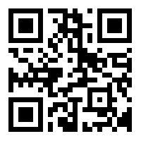

# Connected Digital Energy Meter for Arduino

A library for connecting a Belgian digital energy meter to your home automation system via MQTT.

This library is part of the Connected Digital Energy Meter project. Check it out at [https://cdem.be](https://cdem.be).

## Configuration Page

Access via any url (you may need to choose one that is not in your DNS cache - not recently visited) or scan the QR code below.

## Dependencies

### The PubSubClient Library

PubSubClient is a client library for MQTT messaging.

1. Open the Arduino Library Manager via `Tools => Manage Libraries`
2. Search for `PubSubClient` (make sure to use the library by **Nick O'Leary**)
3. Select the version: `2.8.0`
4. Click install.

### The ArduinoJson Library

The ArduinoJson library allows easy parsing and conversion of JSON strings. The full payload of all the meter telemetry is transmitted as JSON.

1. Open the Arduino Library Manager via `Tools => Manage Libraries`
2. Search for `ArduinoJson` (make sure to use the library by **Benoit Blanchon**)
3. Select the version: `6.18.0`
4. Click install.
