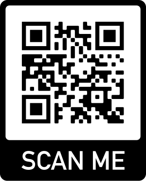

# Connected Digital Energy Meter for Arduino

A library for connecting a Belgian digital energy meter to your home automation system via MQTT.

This library is part of the Connected Digital Energy Meter project. Check it out at https://connected-digital-energy-meter.netlify.app

## Configuration Page

Access via [http://172.16.10.1](http://172.16.10.1) or scan QR code below.

